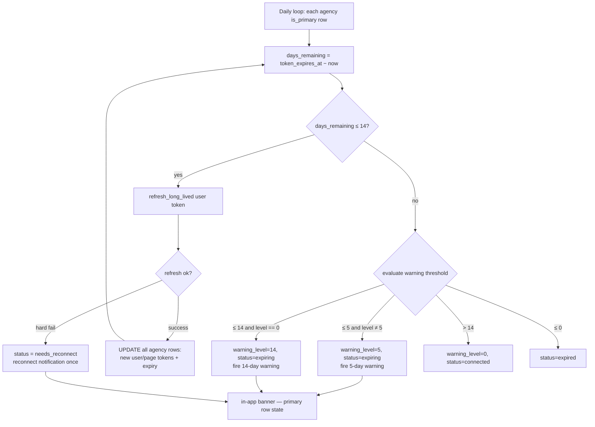

# Meta (Facebook / Instagram) OAuth + Token Service — Design

- **Date:** 2026-06-04
- **Branch:** `feature/dev-170-meta-integration-oauth-token-service-exchange-store-refresh`
- **App:** Slate (`slicify-realestate`)
- **Status:** Approved design — ready for implementation plan

---

## 1. Goal

Let an **agency** connect its Meta account via OAuth and let Slate keep that connection
alive. Concretely:

1. Receive the OAuth `code` from Meta on a callback endpoint.
2. Exchange the short-lived `code` → a **long-lived User access token** (~60 days).
3. Derive a **Page access token** for each managed Facebook Page.
4. Resolve each Page's linked **Instagram Business Account**.
5. Persist all tokens (base64-obfuscated) scoped to the **agency**, one row per
   connected Page/IG in a single flat table.
6. Run a **daily background job** that checks expiry, attempts a **silent refresh**,
   warns the agency at **14 days** and **5 days** remaining, and — if refresh
   fails — notifies the agency admin to reconnect.

> **Tenant ≠ agency.** A tenant is the per-database unit; an agency is the entity that
> owns a Meta connection. Today they happen to be 1:1 in the data model, but the design
> must **not** assume it: a single tenant DB may hold **multiple agencies**, each with
> its own independent Meta connection. Everything below is scoped by `agency_id`, not by
> tenant.

## 2. Context & constraints (from the codebase)

- **Multi-tenant, DB-per-tenant.** Each tenant has its own PostgreSQL database,
  routed from the JWT slug. There is **no local `agency` table** today, and the `User`
  model has only `tenant_id` (no agency scoping) — so currently tenant and agency are
  1:1 in practice. **But a tenant is not necessarily an agency**, and the design must
  support multiple agencies inside one tenant DB. `agency_id` is therefore a real
  scoping column — a nullable string/UUID with **no enforced FK** (no agency entity to
  reference yet) — and every connection row, the daily job, and the notifications are
  scoped by it. The `agency_id` is resolved **server-side** (v1: the tenant's single
  default agency), not supplied by the client.
- **No real encryption in the codebase.** Every credential store uses a base64
  `_obfuscate`/`_deobfuscate` pair (`platform_credentials.py`, `whatsapp_credentials.py`,
  `telegram_credentials.py`). We follow that pattern — "encrypt" here means obfuscate,
  consistent with the rest of Slate. (Upgrading the whole app to Fernet is out of scope.)
- **No scheduler.** Recurring work is an `asyncio` loop started in FastAPI's `lifespan`
  (see `src/services/task_watchdog.py` → `watchdog_loop`). The token monitor follows
  that exact pattern.
- **No generic in-app notification system.** "Notifications" today = the multi-channel
  `send_notification` skill and `needs_attention`/`status` flags surfaced in the UI.
  We deliver expiry warnings as **connection-row state (in-app banner)**, and a
  refresh-failure **reconnect notification** to the agency admin via `send_notification`.
- **Closest existing patterns:** `src/api/trademe_oauth.py` (unauthenticated OAuth
  callback with cross-tenant state lookup) and `src/integrations/tallbob.py` (thin
  `httpx` API client). `FACEBOOK_APP_ID` / `FACEBOOK_APP_SECRET` already exist in
  `src/config.py` (currently empty).

## 3. Decisions (resolved during brainstorming)

| Decision             | Choice                                                                                                                                                                | Rationale                                                                                          |
| -------------------- | --------------------------------------------------------------------------------------------------------------------------------------------------------------------- | -------------------------------------------------------------------------------------------------- |
| Agency scope         | `agency_id` is a first-class scoping column (no FK); **multiple agencies per tenant DB**, each with its own connection                 | Tenant ≠ agency; no agency entity exists to FK to yet                                              |
| Token storage        | **Two tables (normalized):** `agency_social_connections` (one row per agency — the user-token lifecycle) + `agency_social_accounts` (one row per Page/IG — its own page token). See §4 | A flat table duplicated the per-agency user token across every Page row, making refresh/health hard to reason about; splitting puts the lifecycle in one place. Mixpost's per-account fields (provider/provider_id unique, own access_token) inform the accounts table |
| Encryption           | **Base64 obfuscation** (match existing pattern)                                                                                                                       | Consistency with all other Slate credential stores                                                 |
| Expiry notifications | **In-app banner state** (connection row)                                                                                                                              | No generic notification subsystem to build                                                         |
| Refresh failure      | **Explicit reconnect notification to agency admin**                                                                                                                   | Silent refresh can't always succeed; admin must re-auth                                            |
| Meta API client      | **Small in-repo "SDK-lite"** (`httpx`), no third-party SDK                                                                                                            | `facebook-sdk` unmaintained; `facebook_business` too heavy; matches `tallbob.py`                   |
| Tests                | **Integration tests for the background job only** (no unit tests for now)                                                                                             | Per scope request                                                                                  |

## 4. Data model — two normalized tables

Two tables, one Alembic migration, rolled out to every tenant + `slate_template` via
`scripts/migrate_all_tenants.py` (per `CLAUDE.md`). The earlier single flat table copied
the per-agency **user token** (and its expiry/status/warning) onto every Page row, so a
two-Page agency held two copies that had to stay in sync on every refresh — awkward to
reason about. We split that into:

- **`agency_social_connections`** — the OAuth login, **one row per agency**: the
  long-lived **user** token and its lifecycle (expiry, status, warning level). This is the
  single row the daily job reads and writes.
- **`agency_social_accounts`** — the assets, **one row per Page/IG**: the entity's own
  **page** token, FK → its connection. Shape informed by Mixpost's `mixpost_accounts`
  (`provider`/`provider_id` unique, per-account `access_token`).

Because **Page tokens derived from a long-lived user token don't expire**, the accounts
rows need no lifecycle of their own — only the connection's user token does.

### 4.1 `agency_social_connections`

| column | type | notes |
|---|---|---|
| `id` | UUID PK | `UUIDMixin` |
| `agency_id` | string, NOT NULL, **unique** | scoping key; no FK (no agency entity yet). One connection per agency. Indexed |
| `user_access_token` | text, nullable | base64-obfuscated long-lived **user** token — the only token that expires |
| `token_expires_at` | timestamptz, nullable | user-token expiry (~60 days) |
| `status` | string | `connected` \| `expiring` \| `expired` \| `needs_reconnect` \| `error` |
| `warning_level` | smallint, default 0 | `0` = none, `14`, `5` — drives banner + dedupes warnings |
| `last_error` | text, nullable | last refresh/connect error |
| `connected_by_user_id` | UUID, nullable, FK→`users.id` | who initiated the connect — preferred notification recipient |
| `connected_at` | timestamptz, nullable | |
| `last_refreshed_at` | timestamptz, nullable | |
| `last_warned_at` | timestamptz, nullable | |
| `created_at` / `updated_at` | timestamptz | `TimestampMixin` |

### 4.2 `agency_social_accounts`

| column | type | notes |
|---|---|---|
| `id` | UUID PK | `UUIDMixin` |
| `connection_id` | UUID, NOT NULL, FK→`agency_social_connections.id` **ON DELETE CASCADE** | parent connection. Indexed |
| `agency_id` | string, NOT NULL | denormalized scope key (immutable) for single-table per-agency listing. Indexed |
| `platform` | string | `facebook` \| `instagram` |
| `provider_id` | string, NOT NULL | the platform's id — Page id (facebook) or IG account id |
| `name` | string, nullable | page name / IG display name |
| `username` | string, nullable | IG username |
| `access_token` | text, nullable | base64-obfuscated **page** token (IG operations also use the page token); permanent while the user token is valid |
| `is_primary` | bool, default false | the agency's primary Page — anchors banner/display |
| `authorized` | bool, default true | cleared on an auth failure → reconnect (reactive health) |
| `connected_at` | timestamptz, nullable | |
| `created_at` / `updated_at` | timestamptz | `TimestampMixin` |

**Upsert key:** `UNIQUE(connection_id, platform, provider_id)` — reconnecting upserts the
same Page/IG in place (no delete-all/re-insert). `UNIQUE(agency_id)` on the connection
enforces one connection per agency. **Disconnect** deletes the connection row; the
`ON DELETE CASCADE` removes its accounts. Indexes: `agency_id` (both tables),
`connection_id` (accounts).

**Deliberately deferred (YAGNI):** Mixpost's `data`/`media` JSON blobs (provider extras,
avatar) — easy to add to `agency_social_accounts` later when we fetch Page pictures or
need provider-specific metadata.

Models: `src/models/agency_social_connection.py` and
`src/models/agency_social_account.py` (both inherit `Base, UUIDMixin, TimestampMixin`,
joined by a `connection.accounts` / `account.connection` relationship).

## 5. Meta API client — "SDK-lite"

`src/integrations/meta_graph.py` — a single `MetaGraphClient` wrapping
`httpx.AsyncClient`, base URL `https://graph.facebook.com/{META_GRAPH_VERSION}`.
App id/secret from existing `FACEBOOK_APP_ID` / `FACEBOOK_APP_SECRET`. Stateless,
instantiated per request/job. Raises `MetaGraphError` on non-200.

| method | Graph call | returns |
|---|---|---|
| `exchange_code(code, redirect_uri)` | `GET /oauth/access_token` | short-lived user token |
| `exchange_for_long_lived(short_token)` | `GET /oauth/access_token?grant_type=fb_exchange_token` | long-lived token + `expires_in` |
| `get_pages(user_token)` | `GET /me/accounts` | `[{id, name, access_token}]` |
| `get_ig_account(page_id, page_token)` | `GET /{page_id}?fields=instagram_business_account{id,username}` | `{id, username}` or `None` |
| `refresh_long_lived(long_token)` | same `fb_exchange_token` grant | re-issued ~60-day token + `expires_in` |

## 6. OAuth flow

### Connect & callback (sequence)

```mermaid
sequenceDiagram
    actor U as Agency user
    participant FE as Slate frontend
    participant BE as Slate backend (/api/auth/meta/*)
    participant M as Meta Graph API
    participant DB as Tenant DB

    U->>FE: click "Connect Meta"
    FE->>BE: GET /connect
    BE->>BE: resolve agency_id server-side (v1: tenant default)
    BE->>DB: store CSRF state bound to agency_id
    BE-->>FE: 302 → Facebook OAuth dialog URL
    U->>M: open popup, approve (scopes: pages_show_list, …)
    M-->>BE: redirect /callback?code=&state=
    BE->>BE: validate state → resolve agency_id
    BE->>M: exchange_code(code)
    M-->>BE: short-lived user token
    BE->>M: exchange_for_long_lived(token)
    M-->>BE: long-lived user token (+ expires_in ~60d)
    BE->>M: get_pages(user token)
    M-->>BE: [{page, page_token}, …]
    loop each Page
        BE->>M: get_ig_account(page_id, page_token)
        M-->>BE: {ig_id, username} or none
    end
    BE->>DB: insert 1 connection (user token, expiry, status=connected)<br/>+ 1 account/Page and 1 account/IG (page token; first Page is_primary)
    BE-->>U: HTML close-window page → window.opener.postMessage()
    FE->>BE: GET /api/social/meta/connection (refresh UI)
```

### Daily token monitor (flow)

> ⚠️ **Pending re-sync (monitor milestone).** This flowchart and §7 below still describe the
> pre-normalization flat model ("each agency `is_primary` row", "UPDATE all agency rows").
> Under the two-table model the loop iterates **one connection per agency** and writes the
> lifecycle fields to that single connection row. This section will be rewritten when the
> monitor is implemented, together with the **refresh-strategy decision** (page tokens are
> permanent while the user token is valid, and `fb_exchange_token` does not reset the 60-day
> clock — so the loop is primarily warn-at-14/5 + reactive `needs_reconnect`, not a true
> silent extension).



### 6.1 Initiate — `GET /api/auth/meta/connect`
Authenticated (`get_tenant_scoped_db`, `require_permission("settings:manage")`).
The **frontend passes no `agency_id`** — there's no agency entity for it to reference yet
(users only carry `tenant_id`). The backend **resolves the agency server-side**: in v1
that's the tenant's single default agency (a stable derived value); the `agency_id` column
exists so that when a real multi-agency concept arrives (an agency entity + user→agency
membership, or an explicit selector), resolution can change here **without** a schema or
client-contract change. Generates a CSRF `state`, stores it tenant-side (short-lived;
`app_settings` or a dedicated row) **bound to the resolved `agency_id`**, and returns the
Facebook OAuth dialog URL with
`redirect_uri = {PUBLIC_BASE_URL}/api/auth/meta/callback` and scopes:
`pages_show_list`, `pages_read_engagement`, `business_management`,
`instagram_basic`. (`pages_manage_metadata` was dropped — Meta returns
`Invalid Scopes` for it on this app type, and it isn't needed for the
list-Pages / Page-token / read-IG flow; add Page-write scopes like
`pages_manage_posts` later when posting is implemented.)

### 6.2 Callback — `GET /api/auth/meta/callback?code=&state=`
**Unauthenticated** (`get_db` + cross-tenant `state` lookup, mirroring
`trademe_oauth.py`). Single transaction:

1. Validate `state`; resolve the owning **tenant + `agency_id`** it was bound to. Reject
   on mismatch.
2. `exchange_code` → short-lived user token.
3. `exchange_for_long_lived` → long-lived user token; compute `token_expires_at`.
4. **Replace** the agency's existing connection — `delete_by_agency` (the FK
   `ON DELETE CASCADE` clears its accounts), then insert **one** `agency_social_connections`
   row holding the agency-level fields (`user_access_token`, `token_expires_at`,
   `status=connected`, `warning_level=0`, `connected_at`).
5. `get_pages` → append one `agency_social_accounts` child per Page
   (`platform=facebook`, `provider_id`=page id, `access_token` = page token). Mark the
   first Page `is_primary=true`.
6. For each Page, `get_ig_account` → append an account when a linked IG **Business/Creator**
   account is present (`platform=instagram`, `provider_id`=IG id, `access_token` = page
   token). IG accounts are auto-discovered here from the Page's `instagram_business_account`
   field (requires a Business/Creator account linked to that Page and the `instagram_basic`
   scope granted). The explicit **Connect Instagram** button (§6.4) is gated behind a
   connected Facebook Page and makes this step user-triggerable/testable.
7. Return an HTML "you can close this window" page that `postMessage`s the opener
   (TradeMe pattern).

All writes are scoped to the resolved `agency_id` (connection + its accounts), so connecting
one agency never touches another agency's data in the same tenant DB. On any failure: HTML
error page; the delete+insert run in one transaction so nothing is half-written.

### 6.3 Status / disconnect
Both resolve the agency server-side (same as §6.1) — no client-supplied `agency_id` in v1.

- `GET /api/social/meta/connection` — return the resolved agency's **single** connection
  (status/expiry/warning_level + nested `accounts`), or `null`. Drives the UI banner +
  account list. (When multi-agency lands, this becomes a list keyed by agency.)
- `DELETE /api/social/meta/connection` — disconnect: delete the agency's connection (cascade
  clears its accounts).

Namespacing: the OAuth handshake uses **`/api/auth/meta/*`** (`connect`, `callback`) — the
callback is unauthenticated and must match the redirect URI registered in the Meta app;
the data/management endpoints stay under **`/api/social/meta/*`** (`connection`).
Endpoints live in `src/api/meta_social.py`; routers registered in `src/main.py`.

### 6.4 Instagram connect — **depends on Facebook; minimal, for testing this phase**

**Instagram requires a linked Facebook Page.** The Meta tab's **"Connect Instagram"**
button is **disabled/greyed out until a Facebook Page is connected** — the UI enforces the
correct sequence (Facebook first, then Instagram). There is **no standalone Instagram
login** (no IG-without-a-Page): IG always rides on the connected Page's token.

For this phase the action is **deliberately simple** so the Instagram surface can be
exercised end-to-end; robustness/UX is **polished in the next task** (see §13).

- `GET /api/auth/meta/connect/instagram` (authenticated). Pre-condition: the resolved
  agency already has a connected Facebook Page (else 409/disabled). It re-runs the Meta
  OAuth requesting the Instagram scopes (`instagram_basic`; later
  `instagram_content_publish`) and, via the existing page tokens, resolves each Page's
  linked IG Business account and appends the `platform=instagram` accounts (token = the Page
  token). Reuses the §6.2 callback.
- **Scoped down for now:** happy-path only, minimal error rendering, no IG-account picker.
  These are the "polish next task" items. (IG accounts are in fact already auto-derived
  during the Facebook connect in §6.2; this button just makes the step explicit/testable
  and requests the IG scopes.)

This reuses the same two tables, page tokens, and obfuscation helpers — IG accounts are just
more `agency_social_accounts` children of the same connection: no schema change, no separate
IG token type.

## 7. Daily background job — `src/services/meta_token_monitor.py`

An `asyncio` loop started in `main.py`'s `lifespan` via
`asyncio.create_task(meta_token_monitor_loop())`, on a ~24h cycle. Each tick iterates
**all tenant DBs** (same tenant-iteration helper used by the watchdog / migrations), and
within each DB iterates **once per agency** — over the `is_primary` row of each distinct
`agency_id` (the primary row carries the agency-level token/expiry/warning state). For
each agency:

1. **Skip if no user token** — defensively skip any agency whose primary row has a null
   `user_access_token`/`token_expires_at` (shouldn't happen now that IG always rides on a
   Facebook connection, but guards against partial/legacy rows). Otherwise compute
   `days_remaining = (token_expires_at - now).days`.
2. **Attempt silent refresh** when `days_remaining <= 14`: call `refresh_long_lived`.
   - **Hard failure** (user token fully expired / app revoked / OAuthException) →
     `status=needs_reconnect`, stamp `last_error`, **send the reconnect notification**
     (§8) once on the transition, and skip the rest of this row.
   - **Success** → update `user_access_token` + `last_refreshed_at` on all the agency's
     rows; if Meta returned a *materially* later expiry, write the new `token_expires_at`,
     refresh each row's page token via `get_pages`, and recompute `days_remaining`.
   > Refresh is best-effort: for server-side apps Meta frequently returns a token with
   > roughly the *same* remaining lifetime rather than a fresh ~60 days. So we do **not**
   > assume refresh clears the warning — step 3 re-evaluates against the (possibly
   > unchanged) `days_remaining`. Only a genuine expiry extension past the 14-day line
   > resets the warning.
3. **Warning thresholds** (evaluated on the post-refresh `days_remaining`):
   - `days_remaining <= 5` and `warning_level != 5` → `warning_level=5`,
     `status=expiring`, fire 5-day warning, stamp `last_warned_at`.
   - else `days_remaining <= 14` and `warning_level == 0` → `warning_level=14`,
     `status=expiring`, fire 14-day warning, stamp `last_warned_at`.
   - `days_remaining > 14` → `warning_level=0`, `status=connected` (a real extension
     clears prior warnings).
4. `days_remaining <= 0` and still no valid token → `status=expired`.

All agency-level writes (`warning_level`, `status`, `token_expires_at`, etc.) are applied
to **all of that agency's rows** in one `UPDATE … WHERE agency_id=…`, so the denormalized
fields stay consistent. **Idempotency:** `warning_level` (read from the primary row)
ensures a 14-day warning never re-fires; escalation to 5 fires exactly once more; a genuine
refresh that pushes expiry back past 14 days resets it. Reconnect/disconnect resets state.
One agency's Graph error is caught, written to its rows' `last_error`, and the loop
continues to the next agency/tenant (watchdog pattern).

> **Honest note on "silent refresh":** Meta **Page** tokens don't expire while the user
> token is valid, and `fb_exchange_token` *can* re-extend a still-valid long-lived
> **user** token with no user interaction — so step 2 covers most cases. But a fully
> expired user token or a revoked app **cannot** be refreshed silently; those fall
> through to `needs_reconnect` + the reconnect notification. Silent refresh is
> best-effort; the warning/reconnect path is the guaranteed backstop.

## 8. Notifications

All notifications are **per agency** (keyed by `agency_id`), not per tenant.

- **In-app banner (expiry warnings):** no new table. State lives on the **connection**
  (`status`, `warning_level`, `token_expires_at`) — one row per agency.
  `GET /api/social/meta/connection` returns it; the Integrations/Settings page renders a
  banner ("Meta connection expires in N days — reconnect") against the affected agency.
- **Reconnect notification (refresh failure):** when silent refresh fails, in addition
  to `status=needs_reconnect` and the banner, send the **agency admin** a "reconnect your
  Meta account" notification — via the existing `send_notification` path
  (`src/skills/send_notification.py`). Fired once on the
  transition into `needs_reconnect`. Recipient resolution prefers `connected_by_user_id`
  (whoever initiated the connect); if null, fall back to the tenant's admin user(s). The
  message names the `agency_id` so it's actionable.

## 9. Config

In `src/config.py`:
- Reuse existing `FACEBOOK_APP_ID` / `FACEBOOK_APP_SECRET` (no new app-id var). These are
  the **secrets** and already live in `.env.example`.
- Add `META_GRAPH_VERSION` with a **code default** (e.g. `v21.0`). This is **not** a
  required env var and is **not** rolled out per tenant: the Graph version dictates which
  response shapes the code parses, so it should be bumped deliberately alongside the code,
  not drift per deployment. At most, document it as a **commented, optional** override in
  `.env.example` (showing the default) — never an empty `META_GRAPH_VERSION=` line, which
  would override the code default with `""`. It does **not** go in `.env.template` /
  `patch_tenant_envs.py` (that flow is for per-tenant/secret keys).
- Reuse `PUBLIC_BASE_URL` for the redirect URI.

Empty `FACEBOOK_APP_ID` disables the feature cleanly: the connect endpoint returns a
"Meta not configured" error and the job no-ops. The app id/secret are the only Meta values
that vary per environment, and they're already in `.env.example`.

## 10. Frontend (minimal)

A **Meta** tab under **Integrations** with a "Connected accounts" panel holding two cards:

- **Facebook** — "Publish posts to your Facebook Page", status pill (Not connected /
  Connected / Expiring / Needs reconnect), **Connect Facebook** button → opens
  `/api/auth/meta/connect` in a popup, listens for the `postMessage` completion, then
  refreshes from `GET /api/social/meta/connection`. Connected-state is derived from the
  connection's nested `accounts` (a facebook account present ⇒ Facebook connected).
- **Instagram** — **disabled/greyed out until a Facebook Page is connected**, with helper
  text "Connect your Facebook Page first" (the UI enforces the sequence — IG requires a
  linked FB Page). Once Facebook is connected, the **Connect Instagram** button enables and
  is wired to `/api/auth/meta/connect/instagram` (§6.4), which requests the IG scopes and
  links the IG Business account(s) on the connected Page(s) — simple this phase, polished
  next. (IG is also auto-derived during the Facebook connect in §6.2.)

Both buttons share the popup + `postMessage` pattern. The expiry/reconnect banner is driven
by the connection's `status`/`warning_level` (one connection per agency). Register per
`CLAUDE.md` (`App.tsx`, `Sidebar`, `ClientModeGuard`) if it's a new route; if it lives
inside the existing Integrations page, only API wiring is new.

## 11. Testing

**Integration tests for the background job only** (no unit tests for now). Against a
stubbed `MetaGraphClient`, seed `agency_social_connections` rows (a primary + extra
Page/IG rows per agency) at various `token_expires_at` and assert:

- Refresh is attempted first when `days_remaining <= 14`.
- Successful refresh updates the user token/expiry **across all the agency's rows**,
  refreshes each page token, and **resets** `warning_level=0` / `status=connected`
  (no warning fires).
- Refresh **failure** sets `status=needs_reconnect`, stamps `last_error`, and fires the
  reconnect notification **once** (no duplicate on the next tick).
- Warning state machine: `14 → 5 → expired`, with each threshold firing exactly once
  (dedupe via `warning_level`).
- Per-agency isolation: two agencies (distinct `agency_id`) in one tenant DB are handled
  independently — one's expiry/refresh/warning never touches the other's rows; one
  agency's Graph error doesn't abort processing of the other (or of other tenants).

## 12. Files touched

| Area | File |
|---|---|
| Model | `src/models/agency_social_connection.py` |
| Migration | `alembic/versions/<rev>_add_agency_social_connections.py` |
| Meta client | `src/integrations/meta_graph.py` |
| API | `src/api/meta_social.py` (+ register in `src/main.py`) |
| Daily job | `src/services/meta_token_monitor.py` (+ `lifespan` wiring in `src/main.py`) |
| Config | `src/config.py` (`META_GRAPH_VERSION`) |
| Notifications | reuse `send_notification.py` (reconnect notification) |
| Tests | `tests/` — integration tests for the token monitor job |

## 13. Out of scope

- Real (Fernet) encryption of tokens — uses existing base64 obfuscation.
- A generic in-app notification subsystem (table/push) — banner state + `send_notification` only.
- Publishing/posting to Facebook/Instagram — this spec is connect + token lifecycle only.
- Unit tests — integration tests for the background job only, for now.
- **Instagram connect polish (next task).** This phase ships a **simple** "Connect
  Instagram" path (§6.4) for testing — gated behind a connected Facebook Page, happy-path
  connect + store only. Deferred to the next task: robust error handling/UX, an IG-account
  picker, and status-pill nuance. IG riding on a Facebook Page is already handled by the
  auto-derive in §6.2.
- **Standalone Instagram (no Facebook Page).** Out of scope by product decision — IG
  requires a linked Facebook Page, enforced in the UI. If that ever changes, Instagram
  Business Login (its own OAuth + token) could be added; the single flat table would
  accommodate such rows (`platform=instagram`, own `access_token`, no parent Page) with no
  schema change.
